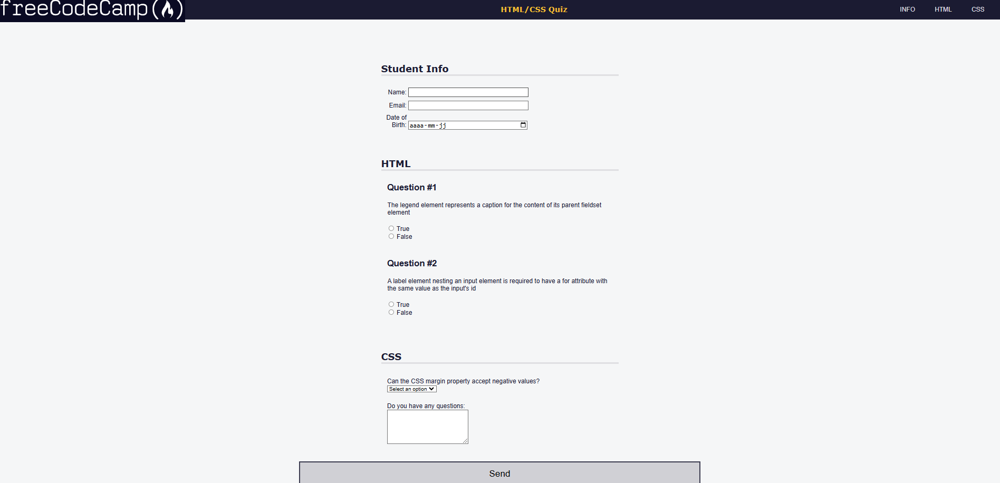

# 📝Quiz
J'apprends l'Accessibilité en créant un Quiz

## 📺 Résultat

  
  
<em> Aperçu du projet</em>

## 🔗 Ressources  
- [FreeCodeCamp - Responsive Web Design](https://www.freecodecamp.org/learn/2022/responsive-web-design/learn-accessibility-by-building-a-quiz/step-1)
- [Tutoriel YouTube](https://youtu.be/u3CzkQnOVUE)

