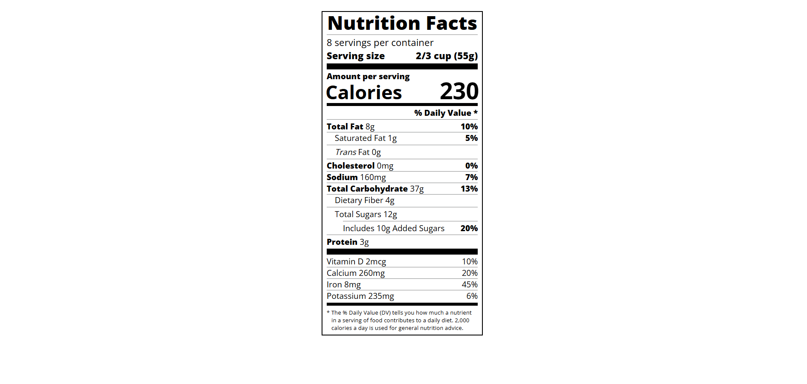

# 🖼📑Étiquette Nutritionnelle
J'apprends la Typographie en créant une Étiquette Nutritionnelle

## 📺 Résultat

  
  
<em> Aperçu du projet</em>

## 🔗 Ressources  
- [FreeCodeCamp - Responsive Web Design](https://www.freecodecamp.org/learn/2022/responsive-web-design/learn-typography-by-building-a-nutrition-label/step-1)
- [Tutoriel YouTube](https://youtu.be/mvzAkIH2O4Q?si=-Yz24P9Q0ak9jdgr)

