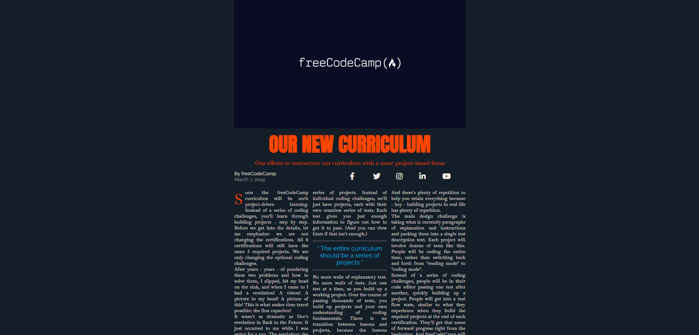

# 📰Magazine
J'apprends le CSS Grid en créant un Magazine

## 📺 Résultat

  
  
<em> Aperçu du projet</em>

## 🔗 Ressources  
- [FreeCodeCamp - Responsive Web Design](https://www.freecodecamp.org/learn/2022/responsive-web-design/learn-css-grid-by-building-a-magazine/step-1)
- [Tutoriel YouTube]()

