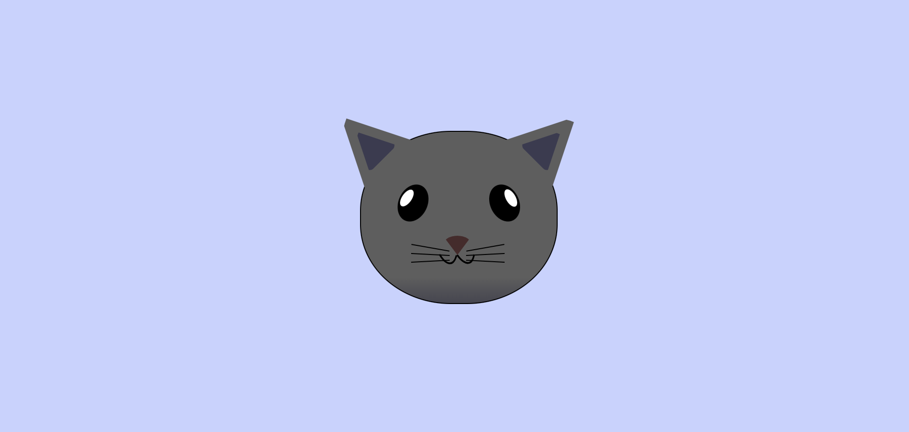

# 😺Peinture de Chat
J'apprends le CSS intermédiaire en créant une Peinture de Chat

## 📺 Résultat

  
  
<em> Aperçu du projet</em>

## 🔗 Ressources  
- [FreeCodeCamp - Responsive Web Design](https://www.freecodecamp.org/learn/2022/responsive-web-design/learn-intermediate-css-by-building-a-cat-painting/step-1)
- [Tutoriel YouTube](https://youtu.be/bRtQpdzvoz0)

