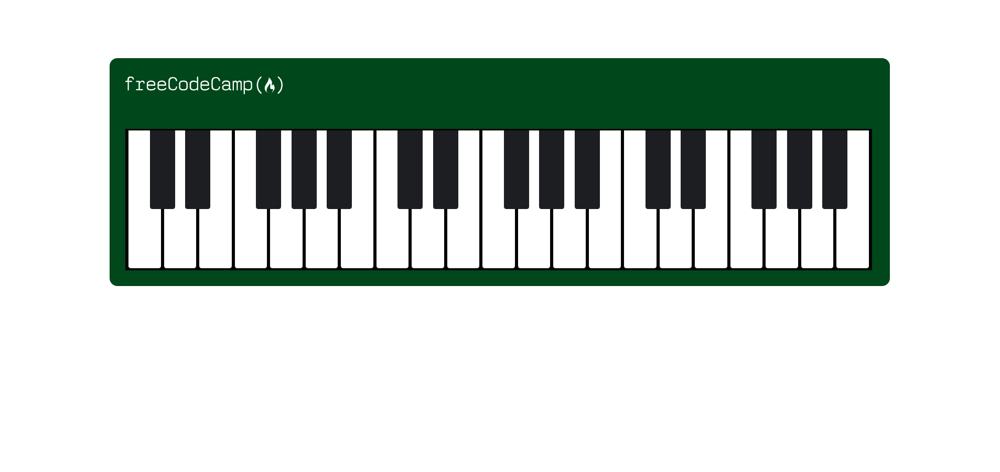

# 🎹Un Piano
J'apprends le Design Web Responsive en créant un Piano

## 📺 Résultat

  
  
<em> Aperçu du projet</em>

## 🔗 Ressources  
- [FreeCodeCamp - Responsive Web Design](https://www.freecodecamp.org/learn/2022/responsive-web-design/learn-responsive-web-design-by-building-a-piano/step-1)
- [Tutoriel YouTube]()

