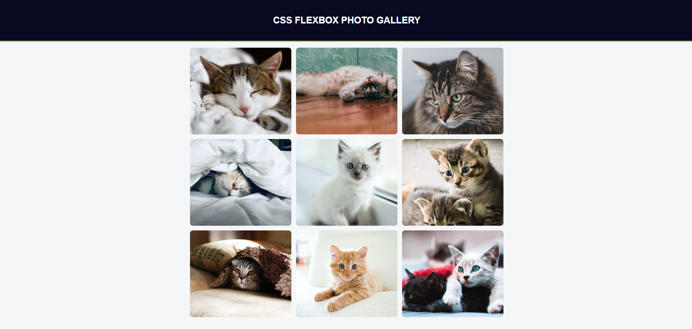

# 🎴Galerie Photo
J'apprends le Flexbox en CSS en créant une Galerie Photo

## 📺 Résultat

  
  
<em> Aperçu du projet</em>

## 🔗 Ressources  
- [FreeCodeCamp - Responsive Web Design](https://www.freecodecamp.org/learn/2022/responsive-web-design/learn-css-flexbox-by-building-a-photo-gallery/step-1)
- [Tutoriel YouTube](https://youtu.be/DRh0tFtV_GY)

