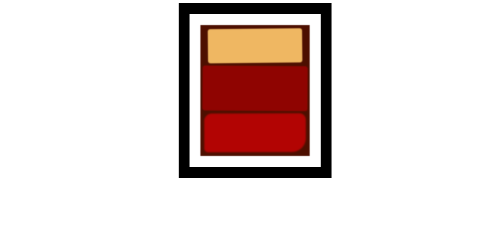

# 🎴Peinture de style Rothko
J'apprends le Modèle de boîte en CSS en créant une Peinture de style Rothko

## 📺 Résultat

  
  
<em> Aperçu du projet</em>

## 🔗 Ressources  
- [FreeCodeCamp - Responsive Web Design](https://www.freecodecamp.org/learn/2022/responsive-web-design/learn-the-css-box-model-by-building-a-rothko-painting/step-1)
- [Tutoriel YouTube](https://youtu.be/ms7oEaRCh7s)

