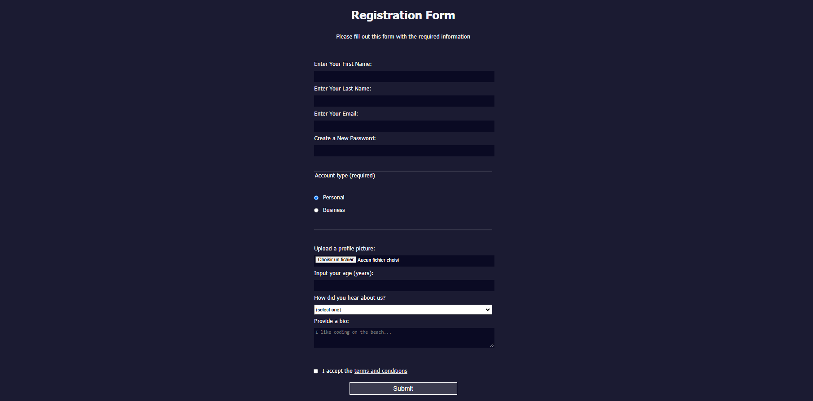

# 🎨Marqueurs Colorés
J'apprends les Couleurs en CSS en créant un ensemble de Marqueurs Colorés

## 📺 Résultat

  
  
<em> Aperçu du projet</em>

## 🔗 Ressources  
- [FreeCodeCamp - Responsive Web Design](https://www.freecodecamp.org/learn/2022/responsive-web-design/learn-css-colors-by-building-a-set-of-colored-markers/step-1)
- [Tutoriel YouTube](https://youtu.be/gJT9VX9ghBQ?si=N1lFYW-HdYJlXIGp)

