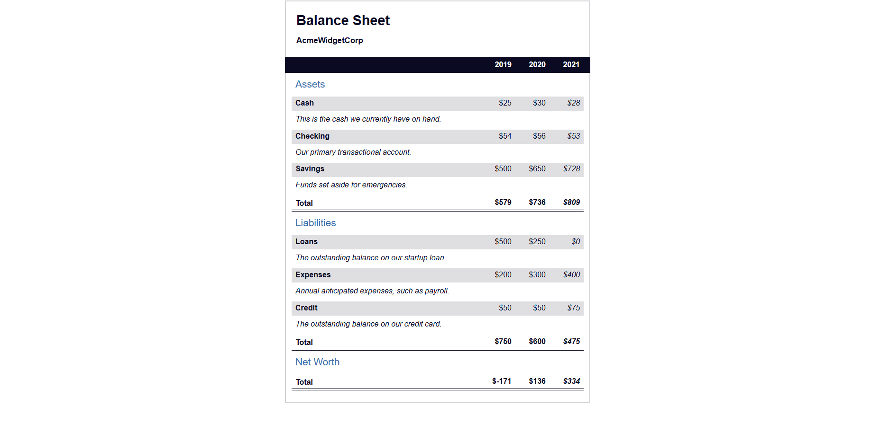

# 📒Bilan Comptable 
J'apprends les Pseudo-sélecteurs CSS en créant un Bilan Comptable

## 📺 Résultat

  
  
<em> Aperçu du projet</em>

## 🔗 Ressources  
- [FreeCodeCamp - Responsive Web Design](https://www.freecodecamp.org/learn/2022/responsive-web-design/learn-more-about-css-pseudo-selectors-by-building-a-balance-sheet/step-1)
- [Tutoriel YouTube](https://youtu.be/gTcNzc8iYkE)

