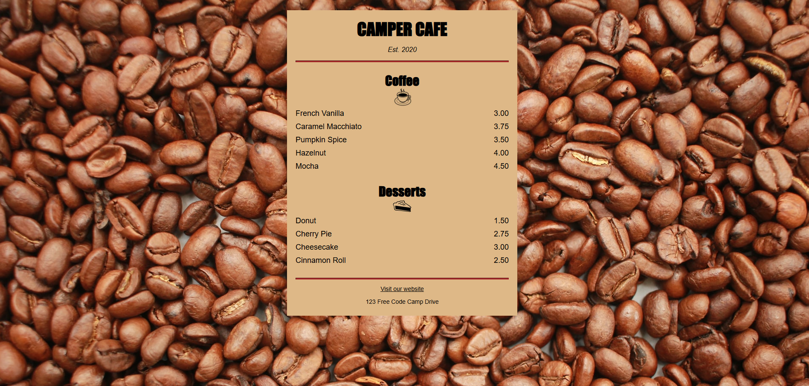

# ☕Café Menu
J’apprends les bases du CSS en créant un Menu de Café

## 📺 Résultat

  
  
<em> Aperçu du projet</em>

## 🔗 Ressources  
- [FreeCodeCamp - Responsive Web Design](https://www.freecodecamp.org/learn/2022/responsive-web-design/learn-basic-css-by-building-a-cafe-menu/step-1)
- [Tutoriel YouTube](https://youtu.be/jgtOo87Tft8?si=EmBcB6W84gs_RU1N)

